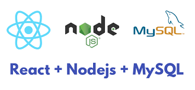

# This is only a template to start a new project using React, Node and MySQL with **Authorization and Authentication in front and back**



# If you want to run this code on your local machine follow these instructions:
## If you had issues running the program or you enjoyed my project please contact me on Linkedin: https://www.linkedin.com/in/jack-amsterdam/

```
1. Git clone the repository.
2. There is a folder called Database -import the sql file into your phpMyAdmin or your MySQL Workbench.
3. Open terminal by clicking on the Backend folder and type: npm i && npm start.
4. Open a second seperate terminal by clicking on the Frontend folder and type: npm i && npm start.
5. Backend Server will run on http://localhost:3001
6. Frontend Server will run on http://localhost:3000
**Since the code is running TypeScript make sure to install these global packages: npm i -g typescript && npm i -g ts-node
```

## Jack's info:

Please check out my info:

https://www.linkedin.com/in/jack-amsterdam/

https://github.com/jackamsterdam

https://hub.docker.com/u/jackamsterdam

https://wakatime.com/@jackamsterdam

https://www.npmjs.com/~jackamsterdam 
